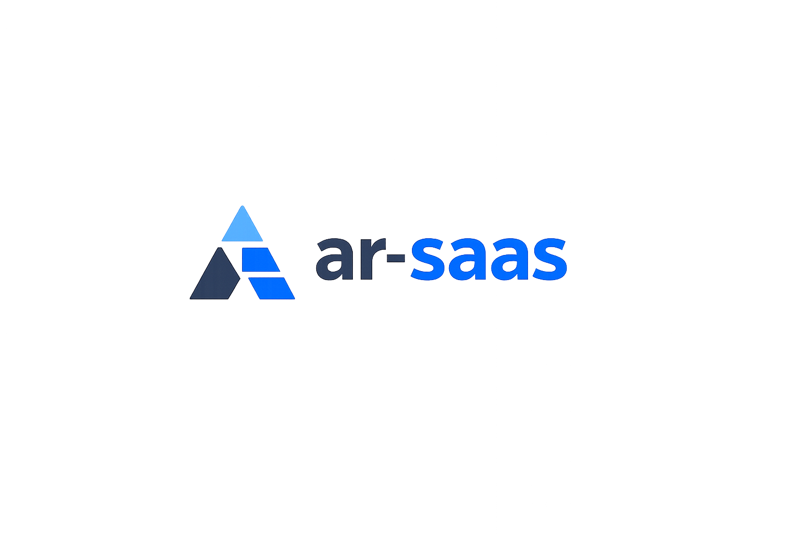

# ar-saas

<p align="center">
  
</p>

<p align="center">
  <strong>Generador de proyectos SaaS multi-tenant para startups argentinas</strong><br/>
  Backend NestJS + Frontend Next.js listos para producción en minutos.
</p>

<p align="center">
  <a href="https://www.npmjs.com/package/ar-saas"></a>
  <a href="https://www.npmjs.com/package/ar-saas"></a>
  <a href="https://github.com/ignaciobecher/ar-saas/blob/main/LICENSE"></a>
  
</p>

---

## Quickstart

```bash
npx ar-saas mi-proyecto
```

Respondés 4 preguntas y en minutos tenés un proyecto completo corriendo localmente.

---

## ¿Qué genera?

```
mi-proyecto/
├── backend/                    # NestJS 11 + MongoDB
│   ├── src/
│   │   ├── modules/
│   │   │   ├── auth/           # Auth completo (JWT en cookies HttpOnly)
│   │   │   ├── users/          # Usuarios con roles
│   │   │   ├── workspaces/     # Multi-tenancy por workspace
│   │   │   └── mail/           # Emails transaccionales con Resend
│   │   └── common/             # Guards, filtros, decoradores, base repository
│   ├── .env.example
│   └── package.json
├── frontend/                   # Next.js 15 + Tailwind CSS 4 + shadcn/ui
│   ├── src/
│   │   ├── app/
│   │   │   ├── (auth)/         # Login, register, verify email, reset password
│   │   │   ├── (dashboard)/    # Rutas protegidas con layout
│   │   │   └── setup/          # Pantalla de onboarding al abrir por primera vez
│   │   ├── providers/          # AuthProvider con estado global
│   │   └── lib/api/            # Cliente axios con refresh automático
│   └── package.json
└── railway.toml / fly.toml / docker-compose.yml
```

---

## Stack

### Backend
| Tecnología | Versión | Uso |
|---|---|---|
| NestJS | 11 | Framework principal |
| MongoDB + Mongoose | 9 | Base de datos |
| JWT (passport) | — | Autenticación en cookies HttpOnly |
| Resend | — | Emails transaccionales |
| Swagger | — | Documentación automática en `/api/docs` |

### Frontend
| Tecnología | Versión | Uso |
|---|---|---|
| Next.js | 15 | App Router, Server Components |
| Tailwind CSS | 4 | Estilos |
| shadcn/ui | — | Componentes UI |
| react-hook-form | — | Formularios |
| axios | — | HTTP client con interceptor de refresh |

---

## Módulos incluidos

### Free (siempre incluidos)

| Módulo | Descripción |
|---|---|
| **Auth completo** | Registro, login, verificación de email, reset de password |
| **Multi-tenancy** | Aislamiento estricto por `workspaceId` en todas las queries |
| **Mail transaccional** | Verificación, bienvenida y reset con Resend. Fail-open si Resend falla |

### Opcionales

| Módulo | Descripción |
|---|---|
| **OAuth + 2FA** | Login con GitHub/Google + autenticación de dos factores TOTP |
| **Notificaciones** | Notificaciones in-app + Push Web (VAPID) |
| **Invoices + Quotes** | Facturación con generación de PDF |
| **CRM** | Kanban + Pipeline de ventas |
| **MercadoPago** | Suscripciones recurrentes con webhooks |

---

## Configuración

Al ejecutar el CLI se copian automáticamente los archivos `.env.example` → `.env`.

### Backend — variables requeridas

| Variable | Descripción |
|---|---|
| `MONGODB_URI` | URI de conexión a MongoDB |
| `JWT_ACCESS_SECRET` | Secreto para access tokens (`openssl rand -hex 64`) |
| `JWT_REFRESH_SECRET` | Secreto para refresh tokens (distinto al anterior) |
| `RESEND_API_KEY` | API Key de [Resend](https://resend.com) |
| `RESEND_FROM_EMAIL` | Email remitente verificado en Resend |
| `APP_URL` | URL del frontend (para links en emails) |
| `CORS_ORIGINS` | URL del frontend separada por comas |

### Frontend — variables requeridas

| Variable | Descripción |
|---|---|
| `NEXT_PUBLIC_API_URL` | URL base del backend (ej: `http://localhost:3000`) |

---

## Deploy

El CLI genera la configuración según el entorno elegido:

### Railway
```toml
# railway.toml generado automáticamente
[build]
builder = "nixpacks"

[deploy]
startCommand = "npm run start:prod"
healthcheckPath = "/api/health"
```

### Fly.io
```toml
# fly.toml generado automáticamente
app = "mi-proyecto"
primary_region = "gru"  # São Paulo
```

### Docker
```yaml
# docker-compose.yml generado automáticamente
# Incluye backend + frontend + MongoDB
docker compose up
```

---

## Iniciar el proyecto generado

```bash
# Backend
cd mi-proyecto/backend
npm install
npm run start:dev
# → http://localhost:3000
# → Swagger: http://localhost:3000/api/docs

# Frontend (en otra terminal)
cd mi-proyecto/frontend
npm install
npm run dev
# → http://localhost:3001
```

La primera vez que abrís el frontend aparece una pantalla de onboarding que guía la configuración completa.

---

## Flujos de autenticación implementados

- `POST /api/auth/register` — Registro con email de verificación
- `GET  /api/auth/verify-email?token=` — Verificación de email
- `POST /api/auth/login` — Login (setea cookies HttpOnly)
- `POST /api/auth/refresh` — Refresh automático del access token
- `POST /api/auth/logout` — Logout (limpia cookies)
- `POST /api/auth/forgot-password` — Solicitud de reset
- `POST /api/auth/reset-password` — Reset de contraseña
- `GET  /api/auth/me` — Datos del usuario autenticado

Los tokens JWT viajan **únicamente en cookies HttpOnly**. Nunca en `localStorage` ni en el body de las respuestas.

---

## Requisitos

- **Node.js** 18+
- **MongoDB** local o [Atlas](https://www.mongodb.com/atlas) (free tier disponible)
- Cuenta en [Resend](https://resend.com) para emails (free tier: 100 emails/día)

---

## Licencia

MIT © 2026 [Ignacio Becher](https://github.com/ignaciobecher)

El código generado por esta herramienta es completamente tuyo, sin restricciones de uso comercial. Podés usarlo, modificarlo y distribuirlo libremente.

---

## Legal

**Propiedad del código generado**

Todo el código que `ar-saas` genera en tu proyecto te pertenece a vos. No reclamamos ningún derecho sobre el código generado ni sobre los productos que construyas con él.

**Sin garantías**

Esta herramienta se provee "tal cual" (*as is*), sin garantías de ningún tipo. No nos hacemos responsables por:

- Vulnerabilidades de seguridad en el código generado si modificás la configuración por defecto
- Daños directos o indirectos derivados del uso del software
- Pérdida de datos o interrupciones de servicio en proyectos construidos con esta herramienta

**Dependencias de terceros**

El código generado incluye dependencias de terceros (NestJS, Next.js, MongoDB, etc.), cada una con su propia licencia. Es tu responsabilidad revisar y cumplir con los términos de cada dependencia en tu proyecto.

**Seguridad**

Si encontrás una vulnerabilidad de seguridad en esta herramienta, por favor reportala abriendo un issue en el [repositorio de GitHub](https://github.com/ignaciobecher/ar-saas) en lugar de hacerlo público. Intentaremos resolverlo a la brevedad.

---

<p align="center">
  Hecho en Argentina 🇦🇷
</p>
